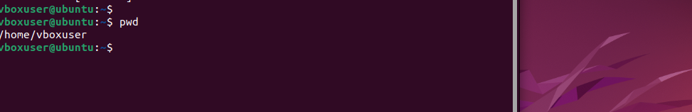
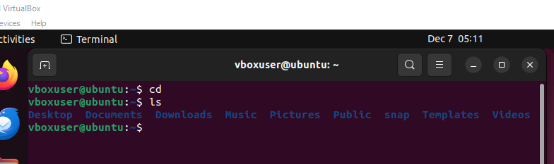
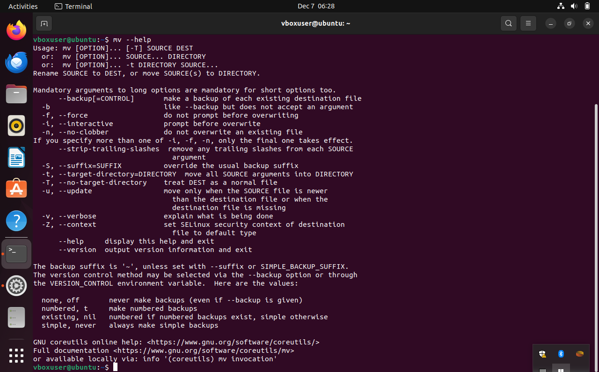
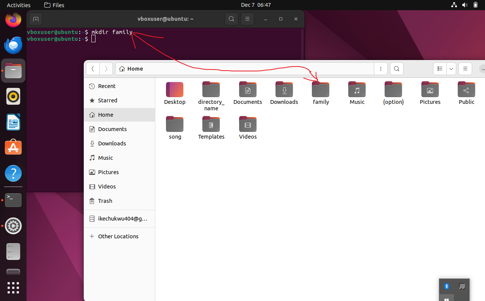
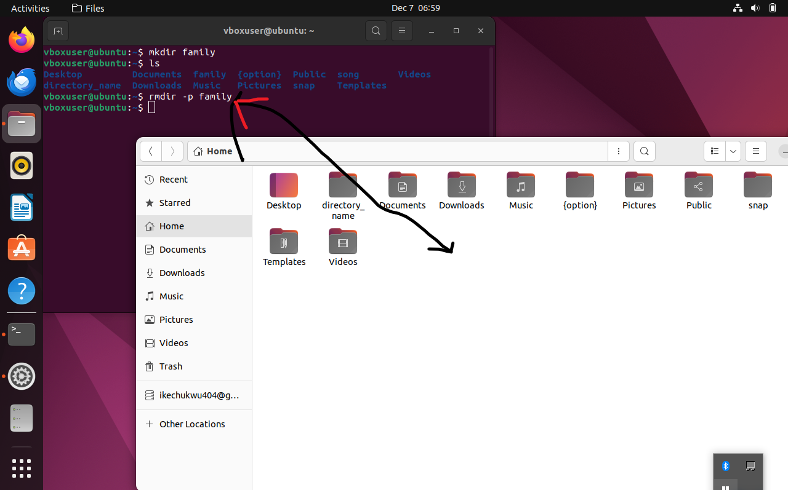
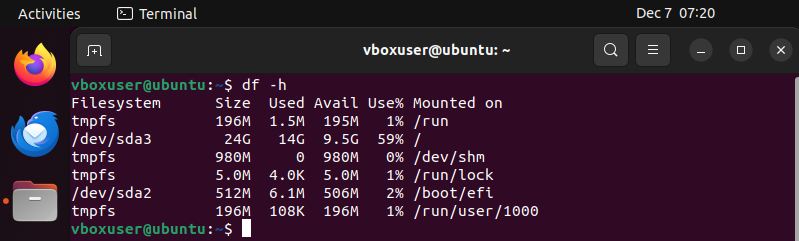
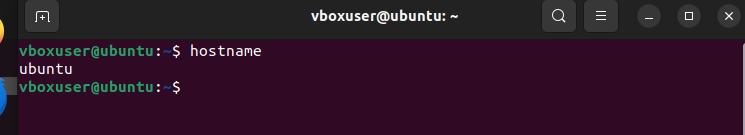
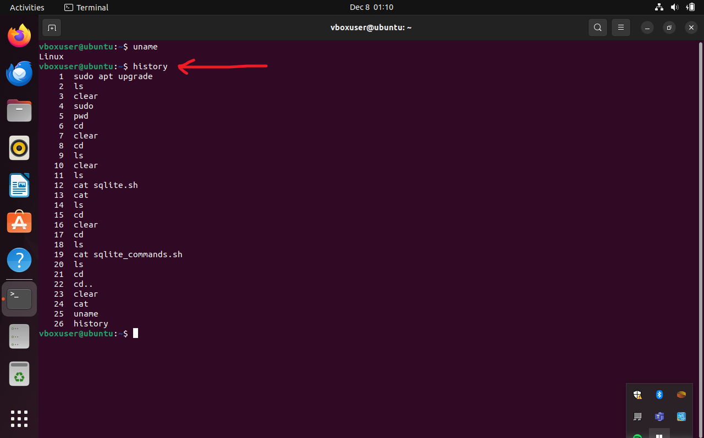
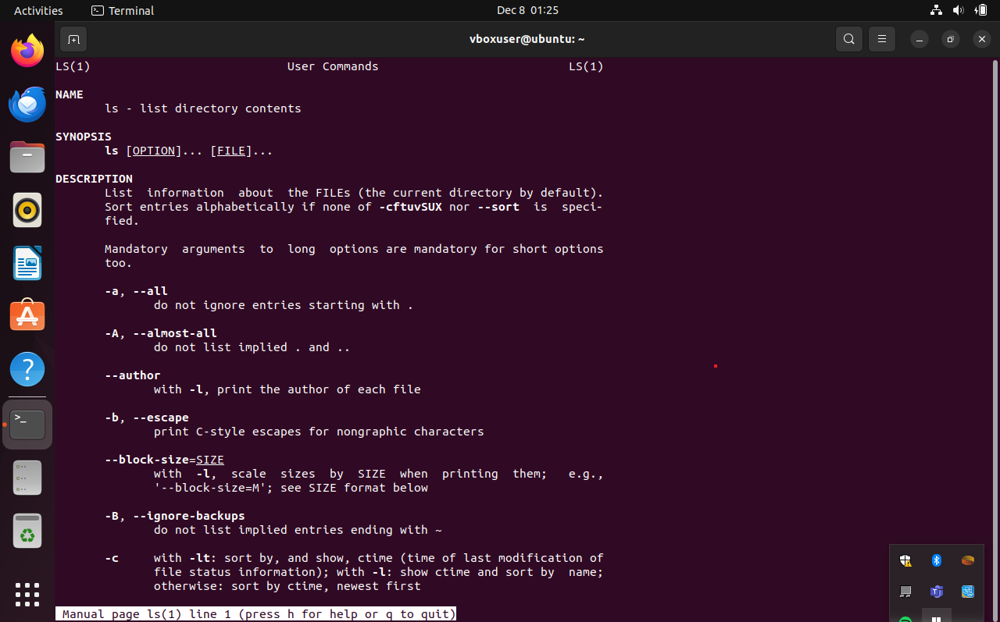

SOME FILE MANIPULATION COMMANDS IN LINUX ENVIROMENT

# sudo comand

1. sudo is a common linux cand used for administrative or root permissions

# pwd command
its a command that helps to find current or resent working directary
!

# cd command
helps to switch to a completly new directory

# ls command
it list files and directory within a system

# mv,
  mv help; is used to move and rename file and directory, while the mv help will help you gain perspective on how to navigate the mv linux command

# mkdir comand;
it helps to make one or more directories and set permission for each of them, the user executing this command must have the privilage to make a new folder in the parent directory]

rmdir command;it is used to delete files within a directory, as you can see the ~family~ directary was deleted.

# rm 
command is used to delete file
eg "rm filename"

9. locate command helps you to find file in the data base eg locate -I school*note

this comand will find file containing school and note

# df command
 is used to report disk usage

# head command; 
allows you to view the first ten lines of a text
eg " head" and click enter

# tail comman:
 is the opposite of head command , it allows you to view the bottom part of a a text
eg "tail" and click enter

# SOME FILE PERMISSION AND OWNERSHIP COMMANDS

# CHMOD
this command modifies a file or directory reads,write and execute permission. in linux, each file is associated with three users namely; class-owner, group members and others

chmon[option] [permission] [file_name]

# chown command
this command let you change the ownership of a file, directory, or symbolic link to a specific username
here is the basic format: chown [option] owner[:group] file(s)

# job command
a job is a proccess that the shell starts, the job command will display all running proccess along with thier status.  remember thst this command is only available in chs,bash,tcsh, and ksh shell

this is the basic syntax: job [optiob] jobID

# kill command
this command is used to terminate unresponsive programme manually, it will signal misbehaving applications and instruct them to close thier proccesses.

to kill a programme, you must know the proccess identification number(PID), if you dont know the PID, run the following command

`ps ux`
after knowing what signal to use, and programme PDI, run the following command
`kill[signal_option] pid`

there are 64 signal that you can use, but this two are among the most commonly used
`SIGTREM` request a program to stop running and give time to save all of its proccess, the system will use this by default if you dont specify the signal when entering the`kill command`.

`SIGKILL` forces programme to stop and you will loose unsaved progress, for example, the programme PID is `33312`, and you want to force it to stop
`KILL SIGKILL 33312`

# ping command
this is to check wether a server or network is reachable, in addition it is used to troubleshoot various connectivity issues.

here is the general format  `ping [option] [hostname_or_ip_address]`

# wget command
this helps you download file the internet, it works in the background without hindering other running process.

the`wget command` retrieves files using HTTP,HTTPS and FTP protocols. it can perform recausive download, which transfers website parts by following directory structures and links, creating local version of the web page

to use it; enter the following commands
`wget [option] [url]`  

eg, enter the following command to download the latest version of wordpress: `wget http://wordpress.org/latest.zip`

# uname command
the uname or the unix name command will print detailed information about your linux system and hardware, this include machine name,operating system and kernel. 
to run this command, simply enter `uname` into your CLI.

# top command
 this command display all the running proccesses and a dynamic real time view of the current system, it suns up the resource utilization, from CPU to memory usage

 `top command` can also help you to identify and terminate a proccess that may use too many system resourses.
 to run the command, simpoly type`top` in your CLI.

 # history command

 this command will help to list up to 500 previously used command, allowing you to reuse them without reentering them.    `keep in mind that only users with sudo previlage can execute this command, and how this utility runs depends on which linux shell you use`.

 # man comand
 provides a user manual of any command or utility you can run on a terminal, including the name, the discripotion, and options.

 it consist of nine section

 executable programme and shell command system call library call game special file file format and conventions system system admintrative command karnel routine miscillaneous to display complete manual, enter :

 i entered `man ls` on my CLI, to get the response above.

 # echo command
 its a built_in utility that displays a line of text or string using the standard output, here is the basic syntax:
 `echo [option] [string]`

 this command suport many options such as :
 -n displays output without trailing new line. -e enables the interpretation of the following backslash escape: \a play sound alart. \b remove space in between a text. \c produces no futher output. -E displays the defalt options and disable the interpretation of backslash escapes.

 # zip,unzip command

 use the zip command to compress file into a zip file, a universal format commonly used on linux, it can automatically choose the best compression ratio

 it is also usefull for achiving files and directory and reducing disk usage.
  to use it , enter th following syntax : `zip [option] zip file file1 file2`

  # hostname command

  this command helps to know the system host name, you can execute with or without an option

  # useradd, userdel commands
  linux is a multy user system, meaning more than one person can use it simultaniously; `useradd` is used to create a new accoun, while the `passwd` allows you to add a new password. 
  only those with root previlages and sudo , can run the useadd command

  when you use the user add command it performs the major changes

  Edit the /etc/passwd/etc/shadow,/etc/group, and/etc/gshadow files for the newly created account. Create and populate a home directory for the user. set file permission and ownership to the home directory. 
  here is the basic syntax`useradd [option] username`

  # apt-get command
 its a command for handling an advance package tool (APT) library in linux., it help you retrieve information and bundles from authenticated source to manage, update, remove and install software and its dependencies.

 running this command requires `sudu or root` precvilages

 here is the main syntex: `apt-get [option] (command)`

 these are the most command that you can add to the apt-get:

 update synchronises the package file from thier sourses, upgrade install the latest version of all installed packages, check update the package cache, and check brocken dependencies.

 #  nano, vi, jed command

 linux allows user to manage and edit file via a tex editor, such as nano,vi and jed

 `nano and vi`, comes with operating system, while`jed` has to be installed.

 the `nano` command denotes keywords and can work with most languages, to use it enter the following command
 `nanol [filename]`

 `vi` usese two operating modes to work -insert and command, `insert is used to create and edit a text file, command performs oprations such as saving, opening, copying etc`

to use`vi` on a file, enter`vi [filename]` 

# alias, unalias command

alias command allows you to create a shortcut with the same funtionality as a command, file name or text when executed, it insruct the shell to replace one string with another

to use the `alias` command enter the syntax;`alias name=string`

# su command

the swith or su command allows you to run a programme as a different user, it changes the administrative account in the current log-in session.
this command is specifically benefitial for accessing the system through SSH, or using the GUI display manager when the root user is unavailable.

here is the general syntax of the command ;`su [option] [username] [argument]]`

# htop command
this command monitors system resourses and server proccesses in real time, it available on most linux distribution, and you can istall it using the default package manager

compare to the  `top command`, `htop command` has many improvements and additional features, such as mouse oprations and visual indicators.     to use it , run the following command`htop [options]`
